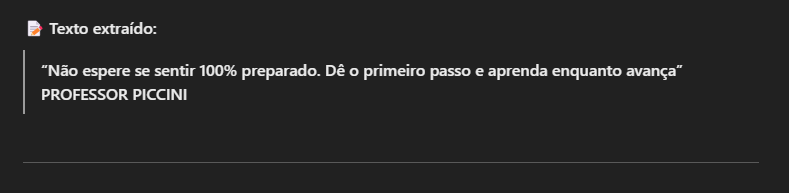

# Projeto OCR Simples com Azure AI Vision

Este projeto demonstra a extração de texto (OCR) usando os serviços da Azure de forma prática e sem necessidade de programação.

## 📂 Estrutura
- **inputs/**: imagens usadas para teste
- **output/**: textos extraídos dessas imagens

## 🧠 Processo
1. Acesse o Azure AI Vision Studio
2. Faça upload da imagem
3. Copie o texto gerado e salve
4. Adicione prints para documentação

## 💡 Insights
- O serviço consegue detectar texto até em imagens com baixa qualidade
- É possível usar isso em sistemas de notas fiscais, cadastros automatizados, etc.

## 🛠️ Ferramentas
- Azure AI Vision (OCR)
- Git e GitHub

## 📸 Exemplo

Texto extraído:

